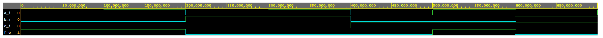
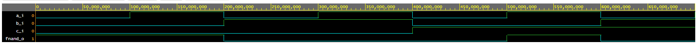
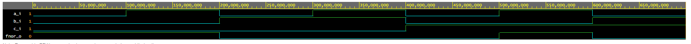
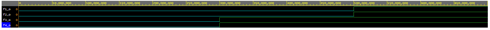

## DeMorgan prva funkcia

[EDA Playground link DeMorgan](https://www.edaplayground.com/x/8LrZ)

```vhdl
begin
    f_o  <= ((not b_i) and a_i) or ((not c_i) and (not b_i));
    
end architecture dataflow;
```



| **c** | **b** |**a** | **f(c,b,a)** |
| :-: | :-: | :-: | :-: |
| 0 | 0 | 0 | 1 |
| 0 | 0 | 1 | 1 |
| 0 | 1 | 0 | 0 |
| 0 | 1 | 1 | 0 |
| 1 | 0 | 0 | 0 |
| 1 | 0 | 1 | 1 |
| 1 | 1 | 0 | 0 |
| 1 | 1 | 1 | 0 |

## DeMorgan druha funkcia NAND

```vhdl
architecture dataflow of gates is
begin
    fnand_o <= not(not(not b_i and a_i) and not(not b_i and not c_i));

end architecture dataflow;
```



| **c** | **b** |**a** | **f(c,b,a) NAND** |
| :-: | :-: | :-: | :-: |
| 0 | 0 | 0 | 1 |
| 0 | 0 | 1 | 1 |
| 0 | 1 | 0 | 0 |
| 0 | 1 | 1 | 0 |
| 1 | 0 | 0 | 0 |
| 1 | 0 | 1 | 1 |
| 1 | 1 | 0 | 0 |
| 1 | 1 | 1 | 0 |

## DeMorgan tretia funkcia NOR 

```vhdl
architecture dataflow of gates is
begin
    fnor_o <= not ((b_i or (not a_i))) or (not(c_i or b_i));

end architecture dataflow;
```



| **c** | **b** |**a** | **f(c,b,a) NOR** |
| :-: | :-: | :-: | :-: |
| 0 | 0 | 0 | 1 |
| 0 | 0 | 1 | 1 |
| 0 | 1 | 0 | 0 |
| 0 | 1 | 1 | 0 |
| 1 | 0 | 0 | 0 |
| 1 | 0 | 1 | 1 |
| 1 | 1 | 0 | 0 |
| 1 | 1 | 1 | 0 |


## Distribucne zakony

[EDA Playground link Dist. zakony](https://www.edaplayground.com/x/8rQJ)


```vhdl
architecture dataflow of gates is
begin
    f1_o <= (x_i and y_i) or (x_i and z_i);
	f2_o <= x_i and (y_i or z_i);
	f3_o <= (x_i or y_i) and (x_i or z_i);
	f4_o <= x_i or (y_i and z_i);

end architecture dataflow;
```




