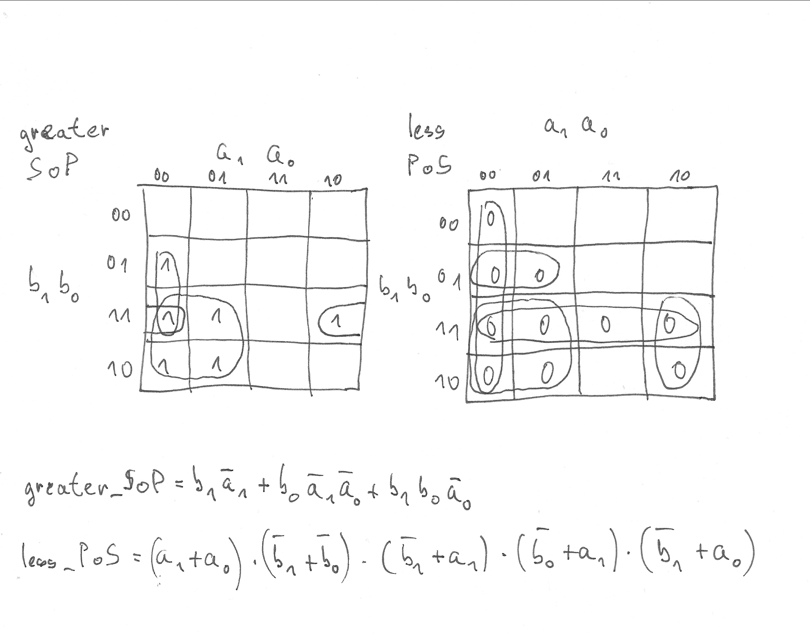
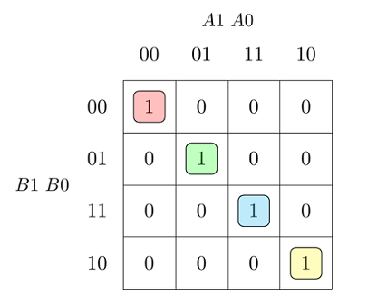

## 02 - Logic
[EDA Playground link for 2-bit comparator](https://www.edaplayground.com/x/ghNq)
| **Dec. equivalent** | **B[1:0]** | **A[1:0]** | **B is greater than A** | **B equals A** | **B is less than A** |
| :-: | :-: | :-: | :-: | :-: | :-: |
| 0 | 0 0 | 0 0 | 0 | 1 | 0 |
| 1 | 0 0 | 0 1 | 0 | 0 | 1 |
| 2 | 0 0 | 1 0 | 0 | 0 | 1 |
| 3 | 0 0 | 1 1 | 0 | 0 | 1 |
| 4 | 0 1 | 0 0 | 1 | 0 | 0 |
| 5 | 0 1 | 0 1 | 0 | 1 | 0 |
| 6 | 0 1 | 1 0 | 0 | 0 | 1 |
| 7 | 0 1 | 1 1 | 0 | 0 | 1 |
| 8 | 1 0 | 0 0 | 1 | 0 | 0 |
| 9 | 1 0 | 0 1 | 1 | 0 | 0 |
| 10 | 1 0 | 1 0 | 0 | 1 | 0 |
| 11 | 1 0 | 1 1 | 0 | 0 | 1 |
| 12 | 1 1 | 0 0 | 1 | 0 | 0 |
| 13 | 1 1 | 0 1 | 1 | 0 | 0 |
| 14 | 1 1 | 1 0 | 1 | 0 | 0 |
| 15 | 1 1 | 1 1 | 0 | 1 | 0 |

equals_SoP = m0 + m5 + m10 + m15 = (!b1.!b0.!a1.!a0) + (!b1.b0.!a1.a0) + (b1.!b0.a1.!a0) + (b1.b0.a1.a0)

less_PoS = 	M0 . 	       M4 . 	      M5 . 	      M8 .	     M9 . 	     M10 . 	     M12 .	     M13 . 	       M14 . 		M15 = </br>
	 = (b1+b0+a1+a0).(b1+!b0+a1+a0).(b1+!b0+a1+!a0).(!b1+b0+a1+a0).(!b1+b0+a1+!a0).(!b1+b0+!a1+a0).(!b1+!b0+a1+a0).(!b1+!b0+a1+!a0).(!b1+!b0+!a1+a0).(!b1+!b0+!a1+!a0)

## Karnaugh maps for 2-bit


</br>

## 4-bit comparator
</br>
[EDA Playground link for 4-bit comparator](https://www.edaplayground.com/x/m8kn)
</br>

</br>

</br>
```vhdl
p_stimulus : process
    begin
        
        report "Stimulus process started" severity note;
        
        	s_b <= "0000"; s_a <= "0000"; wait for 100 ns;   
        	assert ((s_B_greater_A = '0') and (s_B_equals_A = '1') and (s_B_less_A = '0'))              
        report "Test failed for input combination: 0000, 0000" severity error;
        
		s_b <= "0010"; s_a <= "0100"; wait for 100 ns;
		assert ((s_B_greater_A = '0') and (s_B_equals_A = '0') and (s_B_less_A = '1'))
        report "Test failed for input combination: 0010, 0100" severity error;
        
	    	s_b <= "0110"; s_a <= "0001"; wait for 100 ns;
		assert ((s_B_greater_A = '1') and (s_B_equals_A = '0') and (s_B_less_A = '0'))
        report "Test failed for input combination: 0110, 0001" severity error;
        
        	s_b <= "1111"; s_a <= "1111"; wait for 100 ns;
		assert ((s_B_greater_A = '0') and (s_B_equals_A = '1') and (s_B_less_A = '0'))
        report "Test failed for input combination: 1111, 1111" severity error;
        
        	s_b <= "1100"; s_a <= "1101"; wait for 100 ns;
		assert ((s_B_greater_A = '0') and (s_B_equals_A = '0') and (s_B_less_A = '1'))
	report "Test failed for input combination: 1100, 1101" severity error;
        
		s_b <= "0001"; s_a <= "0000"; wait for 100 ns;
		assert ((s_B_greater_A = '1') and (s_B_equals_A = '0') and (s_B_less_A = '0'))
        report "Test failed for input combination: 0001, 0000" severity error;
        
        	s_b <= "0111"; s_a <= "1101"; wait for 100 ns;
		assert ((s_B_greater_A = '0') and (s_B_equals_A = '0') and (s_B_less_A = '1'))
        report "Test failed for input combination: 0111, 1101" severity error;
        
	    	s_b <= "1000"; s_a <= "0111"; wait for 100 ns;
		assert ((s_B_greater_A = '1') and (s_B_equals_A = '0') and (s_B_less_A = '0'))
        report "Test failed for input combination: 1000, 0111" severity error;
        
        	s_b <= "0010"; s_a <= "1100"; wait for 100 ns;
		assert ((s_B_greater_A = '0') and (s_B_equals_A = '0') and (s_B_less_A = '1'))
        report "Test failed for input combination: 0010, 1100" severity error;
        
        	s_b <= "1000"; s_a <= "1000"; wait for 100 ns;
		assert ((s_B_greater_A = '0') and (s_B_equals_A = '1') and (s_B_less_A = '0'))
	report "Test failed for input combination: 1000, 1000" severity error;
        
		s_b <= "1011"; s_a <= "1101"; wait for 100 ns;
		assert ((s_B_greater_A = '0') and (s_B_equals_A = '1') and (s_B_less_A = '0'))
        report "Test failed for input combination: 1011, 1101" severity error;
        
                      
        report "Stimulus process finished" severity note;
        wait;
    end process p_stimulus;
```
</br>
```vhdl
architecture Behavioral of comparator_2bit is
begin
    B_greater_A_o <= '1' when (b_i > a_i) else '0';
	B_equals_A_o  <= '1' when (b_i = a_i) else '0';
	B_less_A_o    <= '1' when (b_i < a_i) else '0';

end architecture Behavioral;
```
	   