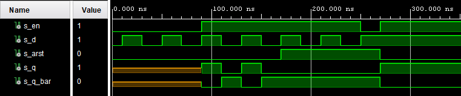
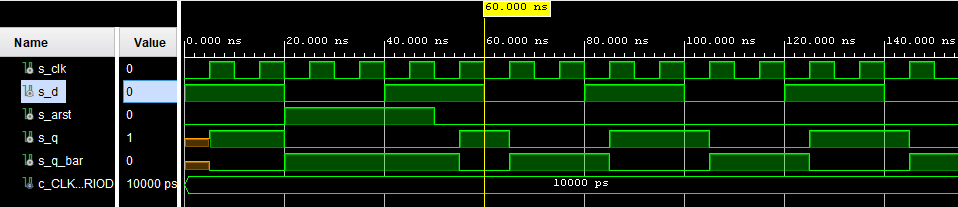
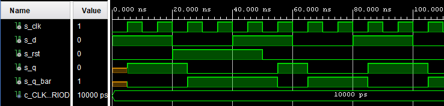
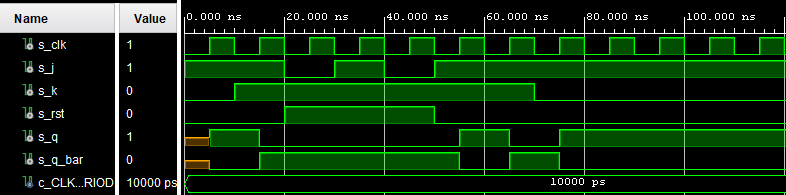
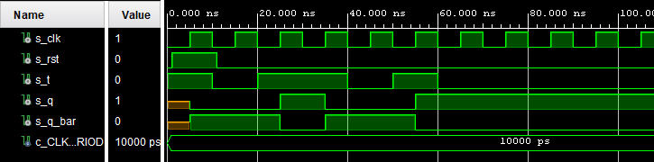
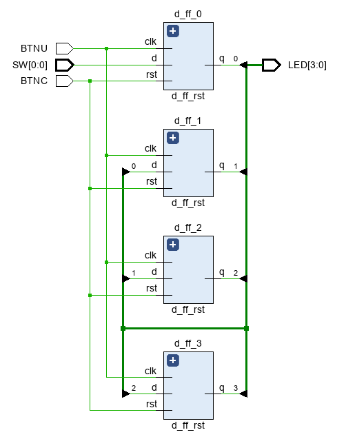

# Lab assigment 07 - Flip-Flops

## Prep. task -  

### Characteristic equations
```vhdl
-------
--D  flip-flop: 
q_(n+1) = d
-------
--JK flip-flop: 
q_(n+1) = j * (not q_n) + (not k) * q_n
------
--T  flip-flop: 
q_(n+1) = t * (not q_n) + (not t) * q_n
```
### Completed tables for D, JK, T flip-flops

   | **D** | **Qn** | **Q(n+1)** | **Comments** |
   | :-: | :-: | :-: | :-- |
   | 0 | 0 | 0 | No change |
   | 0 | 1 | 0 | Change |
   | 1 | 1 | 1 | No change |
   | 1 | 0 | 1 | Change |

   | **J** | **K** | **Qn** | **Q(n+1)** | **Comments** |
   | :-: | :-: | :-: | :-: | :-- |
   | 0 | 0 | 0 | 0 | No change |
   | 0 | 0 | 1 | 1 | No change |
   | 0 | 1 | 0 | 0 | Reset |
   | 0 | 1 | 1 | 0 | Reset |
   | 1 | 0 | 0 | 1 | Set |
   | 1 | 0 | 1 | 1 | Set |
   | 1 | 1 | 0 | 1 | Toggle |
   | 1 | 1 | 1 | 0 | Toggle |

   | **T** | **Qn** | **Q(n+1)** | **Comments** |
   | :-: | :-: | :-: | :-- |
   | 0 | 0 | 0 | No change |
   | 0 | 1 | 1 | No change |
   | 1 | 0 | 1 | Toggle |
   | 1 | 1 | 0 | Toggle |

## D latch

### VHDL code listing of the process `p_d_latch` with syntax highlighting

```vhdl
p_d_latch : process (en, d, arst)
    begin
        if(arst = '1') then
            q     <= '0';
            q_bar <= '1';
        elsif (en = '1') then
            q     <= d;
            q_bar <= not d;
        end if;
     end process p_d_latch;
```

### Listing of VHDL reset and stimulus processes from the testbench `tb_d_latch.vhd` file with syntax highlighting and asserts


```vhdl
 p_stimulus : process
     begin
     
     s_en       <= '0';
     s_d        <= '0';
     s_arst     <= '0';
     wait for 10 ns;
     
     s_d        <= '1';
     wait for 20 ns;
     s_d        <= '0';
     wait for 20 ns;
     s_d        <= '1';
     wait for 20 ns;
     s_d        <= '0';
     wait for 20 ns;
     assert (s_q = '1' and s_q_bar = '0') report "EMPTY SEQUENCE ERROR" severity error;
     --sequence with enable active
     ---------
     s_en   <= '1';     --enabled
     ---------
     s_d        <= '1';
     wait for 20 ns;
     ---------
     s_en   <= '1';     --enabled
     ---------
     s_d        <= '0';
     wait for 20 ns;
     ---------
     s_en   <= '1';     --enabled
     ---------
     s_d        <= '1';
     wait for 20 ns;
     ---------
     s_en   <= '1';     --enabled
     ---------
     s_d        <= '0';
     wait for 20 ns;
     assert (s_q = '1' and s_q_bar = '0') report "ENABLE SEQUENCE ERROR" severity error;
     --sequence with enable and reset active
     ---------
     s_en   <= '1';     --enabled
     ---------
     s_arst <= '1';     --reset
     s_d    <= '1';
     wait for 20 ns;
     ---------
     s_en   <= '1';     --enabled
     ---------
     s_arst <= '1';     --reset
     s_d    <= '0';
     wait for 20 ns;
     ---------
     s_en   <= '1';     --enabled
     ---------
     s_arst <= '1';     --reset
     s_d    <= '1';
     wait for 20 ns;
     ---------
     s_en   <= '1';     --enabled
     ---------
     s_arst <= '1';     --reset
     s_d    <= '0';
     wait for 20 ns;
     ---------
     s_en   <= '0';     --enabled
     ---------
     s_arst <= '1';     --reset
     s_d    <= '1';
     wait for 20 ns;
     ---------
     s_en   <= '1';     --enabled
     ---------
     s_arst <= '0';     --reset
     s_d    <= '1';
     wait for 20 ns;
     assert (s_q = '1' and s_q_bar = '0') report "ENABLE AND RESET SEQUENCE ERROR" severity error;
     wait;
```

### Screenshot with simulated time waveforms - for D latch




## Flip-flops

### VHDL code listing of the processes with syntax highlighting

#### `p_d_ff_arst` - design process

```vhdl
p_d_ff_arst : process(clk, arst)
begin
    if (arst = '1') then
        q       <= '0';
        q_bar   <= '1';
    elsif rising_edge(clk) then
        q       <= d;
        q_bar   <= not d;
    end if;
    end process p_d_ff_arst;
```

####  `tb_d_ff_arst` - process from testbench

```vhdl
p_d_ff_arst :process
    begin
        s_d    <= '1'; 
        wait for 20 ns;
        assert (s_q = '1' and s_q_bar = '0') report "ERROR - FIRST FLIP" severity note;
        s_d    <= '0';
        wait for 20 ns;
        assert (s_q = '0' and s_q_bar = '1') report "ERROR - FIRST FLIP" severity note;
        s_d    <= '1';
        wait for 20 ns;
        assert (s_q = '1' and s_q_bar = '0') report "ERROR - 2. FLIP" severity note;
        s_d    <= '0';
        wait for 20 ns;
        assert (s_q = '0' and s_q_bar = '1') report "ERROR - 2. FLIP" severity note;
        s_d    <= '1'; 
        wait for 20 ns;
        assert (s_q = '1' and s_q_bar = '0') report "ERROR - 3. FLIP" severity note;
        s_d    <= '0';
        wait for 20 ns;
        assert (s_q = '0' and s_q_bar = '1') report "ERROR - 3. FLIP" severity note;
        s_d    <= '1';
        wait for 20 ns;
        assert (s_q = '1' and s_q_bar = '0') report "ERROR - 4. FLIP" severity note;
        s_d    <= '0';
        wait for 20 ns;
        assert (s_q = '0' and s_q_bar = '1') report "ERROR - 4. FLIP" severity note;
        wait;
    end process p_d_ff_arst;
```

#### Screenshot with simulated time waveforms - for D flip-flop (async reset)



#### `p_d_ff_rst` - design process

```vhdl
p_d_ff_rst : process(clk)
    begin        
        if rising_edge(clk) then
            if (rst = '1') then
                q       <= '0';
                q_bar   <= '1';
            else
                q       <= d;
                q_bar   <= not d;
            end if;
        end if;
    end process p_d_ff_rst;
```

#### `tb_d_ff_rst` - process from testbench 

```vhdl
 p_d_ff_rst : process
    begin
    
        s_d    <= '1'; 
        wait for 20 ns;
        assert (s_q = '1' and s_q_bar = '0') report "ERROR - FIRST FLIP" severity note;
        
        s_d    <= '0';
        wait for 20 ns;
        assert (s_q = '0' and s_q_bar = '1') report "ERROR - FIRST FLIP" severity note;
        
        s_d    <= '1';
        wait for 20 ns;
        assert (s_q = '1' and s_q_bar = '0') report "ERROR - 2. FLIP" severity note;
        
        s_d    <= '0';
        wait for 20 ns;
        assert (s_q = '0' and s_q_bar = '1') report "ERROR - 2. FLIP" severity note;
        
        s_d    <= '1'; 
        wait for 20 ns;
        assert (s_q = '1' and s_q_bar = '0') report "ERROR - 3. FLIP" severity note;
        
        s_d    <= '0';
        wait for 20 ns;
        assert (s_q = '0' and s_q_bar = '1') report "ERROR - 3. FLIP" severity note;
        
        s_d    <= '1';
        wait for 20 ns;
        assert (s_q = '1' and s_q_bar = '0') report "ERROR - 4. FLIP" severity note;
        
        s_d    <= '0';
        wait for 20 ns;
        assert (s_q = '0' and s_q_bar = '1') report "ERROR - 4. FLIP" severity note;
        
        wait;
    
    end process p_d_ff_rst;
```

#### Screenshot with simulated time waveforms - for D flip-flop (sync reset)



#### `p_jk_ff_rst` - design process

```vhdl
 p_jk_ff_rst : process(clk)
        begin
            if rising_edge(clk) then
                if (rst = '1') then
                    s_q         <=  '0';
                    s_q_bar     <=  '1'; 
                else
             
                    if (j = '0' and k = '0') then 
                        s_q     <=  s_q;
                        s_q_bar <=  s_q_bar;
                    
                    elsif (j = '0' and k = '1') then 
                        s_q     <=  '0';
                        s_q_bar <=  '1';
                    
                    elsif (j = '1' and k = '0') then 
                        s_q     <=  '1';
                        s_q_bar <=  '0';
                    
                    else 
                        s_q     <=  not s_q;
                        s_q_bar <=  not s_q_bar;
                    end if;
                end if;
            end if;
        end process p_jk_ff_rst;
```

#### `tb_jk_ff_rst` - process from testbench

```vhdl
p_jk_ff_rst :process
    begin
    
        s_j <=  '1';
        s_k <=  '0'; 
        wait for 10ns;
        assert (s_q = '1' and s_q_bar = '0') report "FIRST SET ERROR" severity error;
        
        s_j <=  '1';
        s_k <=  '1';
        wait for 10ns;
        assert (s_q = '0' and s_q_bar = '1') report "FIRST TOGGLE ERROR" severity error;
        
        s_j <=  '0';
        s_k <=  '1';
        wait for 10ns;
        assert (s_q = '0' and s_q_bar = '1') report "FIRST RESET ERROR" severity error;
                
 
        s_j <=  '1';
        s_k <=  '1';
        wait for 10ns;
        assert (s_q = '1' and s_q_bar = '0') report "2. TOGGLE ERROR - acceptable" severity error;    --error reported because reset is active
        
        s_j <=  '0';
        s_k <=  '1';
        wait for 10ns;
        assert (s_q = '0' and s_q_bar = '1') report "2. RESET ERROR" severity error;
        
        s_j <=  '1';
        s_k <=  '1';
        wait for 10ns;
        assert (s_q = '1' and s_q_bar = '0') report "3. TOGGLE ERROR" severity error;
        
        s_j <=  '1';
        s_k <=  '1';
        wait for 10ns;
        assert (s_q = '0' and s_q_bar = '1') report "4. TOGGLE ERROR" severity error;
        
        
        s_j <=  '1';
        s_k <=  '0'; 
        wait for 10ns;
        assert (s_q = '1' and s_q_bar = '0') report "2. SET ERROR" severity error;
        wait;
       
    end process p_jk_ff_rst; 
```

#### Screenshot with simulated time waveforms - for JK flip-flop (sync reset)




#### `p_t_ff_rst` - design process

```vhdl
p_t_ff_rst : process(clk)
    begin
        if rising_edge(clk) then
            if (rst = '1') then
                s_q         <=  '0';
                s_q_bar     <=  '1'; 
                
             else
                if (t = '0') then
                    s_q     <=  s_q;
                    s_q_bar <=  s_q_bar;
                    
                else
                    s_q     <=  not s_q;
                    s_q_bar <=  not s_q_bar;
                end if;
             end if;
        end if;
    end process p_t_ff_rst;
```

#### `tb_t_ff_rst` - process from testbench

```vhdl
p_t_ff_arst : process
    begin
    
        s_t <=  '1';
        wait for 10ns;
        assert (s_q = '0' and s_q_bar = '1') report "FIRST TOGGLE ERROR" severity error; -- reset active
        
        s_t <=  '0';
        wait for 10ns;
        assert (s_q = '0' and s_q_bar = '1') report "FIRST NO CHANGE ERROR" severity error; -- reset was active
        
        s_t <=  '1';
        wait for 10ns;
        assert (s_q = '1' and s_q_bar = '0') report "2. TOGGLE ERROR" severity error;
        
        s_t <=  '1';
        wait for 10ns;
        assert (s_q = '0' and s_q_bar = '1') report "3. TOGGLE ERROR" severity error;
        
        s_t <=  '0';
        wait for 10ns;
        assert (s_q = '0' and s_q_bar = '1') report "2. NO CHANGE ERROR" severity error;
        
        s_t <=  '1';
        wait for 10ns;
        assert (s_q = '1' and s_q_bar = '0') report "4. TOGGLE ERROR" severity error;
        
        s_t <=  '0';
        wait for 10ns;
        assert (s_q = '1' and s_q_bar = '0') report "3. NO CHANGE ERROR" severity error;
        wait;
        
        s_t <=  '0';
        wait for 10ns;
        assert (s_q = '1' and s_q_bar = '0') report "4. NO CHANGE ERROR" severity error;
        
        s_t <=  '1';
        wait for 10ns;
        assert (s_q = '0' and s_q_bar = '1') report "5. TOGGLE ERROR" severity error;
    
    end process p_t_ff_arst;
```

#### Screenshot with simulated time waveforms - for T flip-flop (sync reset)



### Listing of VHDL clock and reset from the testbench files with syntax highlighting 

#### Clock (is same in every file)

```vhdl
p_clk_gen : process
    begin
        while now < 750 ns loop         -- 75 periods of 100MHz clock
            s_clk <= '0';
            wait for c_CLK_100MHZ_PERIOD / 2;
            s_clk <= '1';
            wait for c_CLK_100MHZ_PERIOD / 2;
        end loop;
        wait;
    end process p_clk_gen;
```

#### Reset (is same in every file, except `tb_t_ff_rst.vhd` - is shown separately)

```vhdl
p_reset_gen : process
    begin
        s_arst <= '0';
        wait for 20 ns;
        s_arst <= '1';                 -- Reset activated
        wait for 30 ns;
        s_arst <= '0';
        wait;
    end process p_reset_gen;
```

#### Reset for `tb_t_ff_rst.vhd`

```vhdl
p_reset_gen : process
    begin
        s_rst <= '0';
        wait for 1 ns;
        s_rst <= '1';                 -- Reset activated
        wait for 10 ns;
        s_rst <= '0';
        wait;
    end process p_reset_gen;
```

### Shift register

#### Image of the shift register schematic




